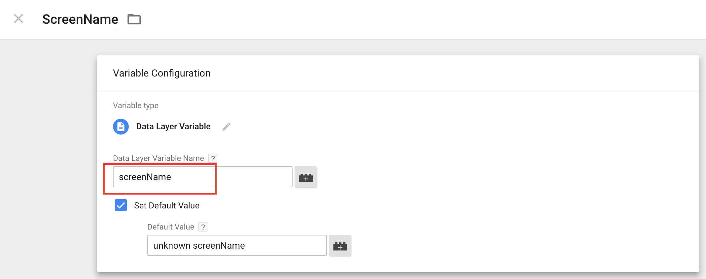

# Google Tag Manager for Android App's
[Before we look at implementing GTM for developers let's have a deeper look at official website][1]

## Before beginning a few concepts you should know 
#### TAG
A tag is a piece of code that sends information to a third party, such as Google Analytics.

#### TRIGGER
A trigger is a condition that evaluates to either true or false at runtime. Triggers attached to a tag
govern when the tag is fired or not fired.
All triggers are associated with a a event type.

#### EVENT
An event can be a pageview, a click on a button, a form submmission or any custom event that you define.
Tag Manager has 4 built-in event types plus a custom event option.
Triggers from the container are evaluated and tags are fired accordingly. No tag can be fired unless an event occurs.
 
[For more information about category,action, label , value][3]


Go to Mobile APIs and select `GET STARTED FOR ANDROID` option and this redirect to [the official documentation for Android][2].
In this page we'll see by default the implementation of TagManager with Firebase, but for this sample project
we'll see how to implement it by using Legacy way(orange rectangle), without Firebase.

<p align="center">
    
</p>

And Click `Android v4` option.

## Implementing Universal Analytics and Google Tag Manager SDK for android

# Getting Started

1. Go to [tagmanager-google.com][2] to create a Tag Manager account(or to access an existing account).
2. When you logged-in to Google Tag Manager you'll see option's tab as follow below:

<p align="center">
    
</p>


3. Click new account and set up our container:

<p align="center">
    
</p>


### Firebase(Android)
If we select this Android SDK version, we always download a json file for our project's implementation. 

### Legacy Android
If we select this Android SDK version, we can download a binary file necessary for the  
'loadContainerPreferNonDefault' method of the Google Play Service SDK.
See the code's snippet below:

```shell
PendingResult<ContainerHolder> pending =
                tagManager.loadContainerPreferNonDefault(CONTAINER_ID,
                        R.raw.orbismobiletracking_binarie);
```

For our case we'll be using the Legacy Android SDK version

# Configuring GoogleTagManager Web Interface 

<p align="center">
    
</p>

### Tracking App View 
### Variables
On the left navigation bar, click `Variables` and should see:

<p align="center">
    
</p>

There are Built-In Variables and User-Defined Variables, let's create the second one as follow below.

<p align="center">
    
</p>


### Trigger
 On the left navigation bar, click `Triggers` and should see: 

<p align="center">
    
</p>


#### TRIGGER TYPE
Actually there are 9 built-in Firebase automatic event types and 2 other event types.

<p align="center">
    
</p>


### Tags
On the left navigation bar, click `Tags` and should see:

1. Select Universal Analytics like our `Tag type`.
2. Enter the Tracking ID of our Google Analytics account.
3. In `Track Type` comboBox we can select different options:
 * App View (for screen name, app views) 
    <p align="center">
        
    </p>
 
 * Events (for clicks on button) 
    <p align="center">
         
     </p>
 
4. 

<p align="center">
    
</p>


[1]: https://developers.google.com/tag-manager/
[2]: https://developers.google.com/tag-manager/android/v5/
[3]: https://support.google.com/tagmanager#topic=
[4]: https://tagmanager.google.com/#/home
[5]: https://developers.google.com/tag-manager/android/v4/ua#create-screen-name-var
[6]: https://support.google.com/analytics/answer/6164470?hl=en

